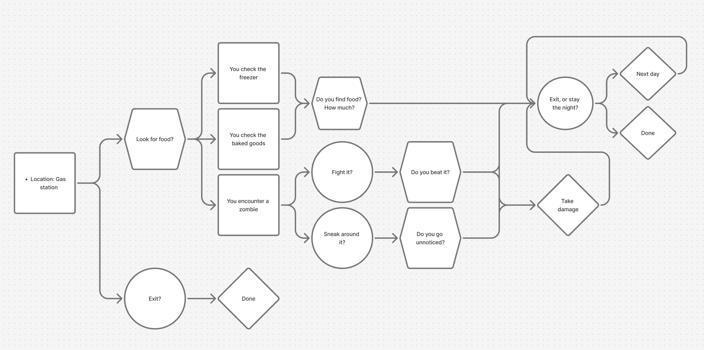

# Days Left

A game where you orient a world that has been taken over by zombies. You make decisions based on the scenario and the environment reacts to it.

## How does it work?

I used a web framework called svelte to make the developer experience better. It makes it so I can write svelte components and compose my UI using them. Then it compiles this svelte code into minified HTML, CSS and JavaScript

I'll attempt to explain it the best I can, and how the features I used work.

### Entry Point

/App.svelte

```html
<script lang="ts">
    import { AppState } from "./lib/state.svelte";
    import Launcher from "./lib/Launcher.svelte";
    import Game from "./lib/Game.svelte";

    let currentState = AppState.LAUNCHER;

    function goToGame() {
        currentState = AppState.GAME;
    }
</script>

<main>
    {#if currentState === AppState.LAUNCHER}
        <Launcher onPlay={goToGame} />
    {:else if currentState === AppState.GAME}
        <Game />
    {/if}
</main>
```

Here is the entry point for my web app. You can see that we have a <main> tag. Inside here we have an if statement that renders my <Launcher> component if the AppState is set to LAUNCHER, but if it isn't and is rather set to GAME, render my Game component

To actually switch state, my launcher component takes in an onPlay function. Here I switch the state to GAME when clicked, as you can see above.

### UI

I have a folder called UI that contains parts of the ui that is supposed to be somewhat reusable. For instance, here I have a Button component (used for most interactions in the game), DayCount (which display the day count in the corner), StatusBar (which contains multiple CircularMeters with SVG icons and is linked up to the game state so it updates) and CircularMeter (which displays a circular meter based on a variable).

/lib/ui/Button.svelte

```html
<script lang="ts">
    import type { Snippet } from "svelte";
    import type { MouseEventHandler } from "svelte/elements";

    let {
        onclick,
        children,
    }: { onclick: MouseEventHandler<HTMLButtonElement>; children: Snippet } =
        $props();
</script>

<button class="button" {onclick}>
    {@render children?.()}
</button>

<style>
    .button {
        background-color: #000000;
        border: none;
        color: white;
        padding: 12px 24px;
        text-align: center;
        text-decoration: none;
        font-family: "Special Elite", system-ui;
        font-weight: 400;
        font-style: normal;
        display: inline-block;
        font-size: 16px;
        cursor: pointer;
        transition: background-color 0.3s;
    }
    .button:hover {
        background-color: #333333;
    }
</style>
```

I figured I would showcase the button component which basically just consists of a button. You can see that there is some magic inside the button (the @render children) which simply injects whatever we put between the tags when using the component.

So I can do `<Button>This gets rendered where the @render children is</button>`

We also run whatever function they provide when the button is clicked, so it can trigger whatever we want.

### Launcher

/lib/Launcher.svelte

```html
<script lang="ts">
    import Button from "./ui/Button.svelte";

    let { onPlay }: { onPlay: () => void } = $props();
</script>

<div>
    
    <Button onclick={onPlay}>Launch</Button>
</div>

<style>
    div {
        display: flex;
        justify-content: center;
        align-items: center;
        flex-direction: column;
        gap: 20px;
        min-height: 80vh;
    }
</style>

```

This simply contains my Button component. It calls the onPlay function that is passed from the parent. I also render an svg.

### Game

Here we actually render what you see when playing the game. The four main elements are:

The day counter which simply displays how many days you've survived

The statusbar which contains three meters displaying your health, thirst and hunger.

The interaction of the game. Here we display an interactive screen depending on what is happening. This could be a dice roll, simple message or multiple choices. I included multiple dies because I started with a d20, but I ended up only using the d6 so the others are really out of date.

Finally we have the inventory which displays what items you have.

/lib/Game.svelte

```html
<script lang="ts">
    import type {
        D20Display,
        D6Display,
        InfoDisplay,
        MultipleChoiceDisplay,
    } from "./display/display.svelte";
    import { gameState } from "./state.svelte";
    import CInfoDisplay from "./display/CInfoDisplay.svelte";
    import CMultipleChoice from "./display/CMultipleChoice.svelte";
    import CD20Display from "./display/CD20Display.svelte";
    import CD6Display from "./display/CD6Display.svelte";
    import StatusBar from "./ui/StatusBar.svelte";
    import DayCount from "./ui/DayCount.svelte";
</script>

<main>
    <DayCount></DayCount>
    <StatusBar></StatusBar>
    <div class="content">
        {#if gameState.display.type === "info"}
            <CInfoDisplay {...gameState.display as InfoDisplay} />
        {:else if gameState.display.type === "multiple_choice"}
            <CMultipleChoice {...gameState.display as MultipleChoiceDisplay} />
        {:else if gameState.display.type === "d20"}
            <CD20Display {...gameState.display as D20Display} />
        {:else if gameState.display.type === "d6"}
            <CD6Display {...gameState.display as D6Display} />
        {/if}
    </div>
    <ul>
        {#each gameState.inventory as item}
            <li>{item.name}</li>
        {/each}
    </ul>
</main>

<style>
    .content {
        display: flex;
        justify-content: center;
        align-items: center;
        min-height: 100vh;
    }
</style>
```

The actual branching story comes from a pretty clever system where we have many functions. Each change what is displayed in the middle of the screen. They set what the different buttons do and those buttons call other functions or even set it to call itself when pressed. This leads to a type of node three which you can navigate by pressing buttons.

 

Here you can see an example of a branching story tree I made. The pipes show what possible scenarios are possible to get out of it and each node maps roughly to one function. in the code.

So, how does this map to my code? I first have components for how to display everything that are prefixed with a "C" to indicate that it is infact a component. This includes MultipleChoice, InfoDisplay, D6Display, etc...

I then also have a display.svelte.ts file that simply provides type safety for using the branch system. What is type safety? It enforces that a variable is of a specific type like Number or String and that functions take in all the arguments it needs. This makes my code less bug prone and catches many errors early. This is what TypeScript does for me.

### Game State

So far, I've thrown around the word "Game State" and it basically just stores information about what is happening. This could for instance be how much health the player has, what items they have or how many days they've survived. I can access this pretty much anywhere and Svelte takes care of syncing and updating the state across the site.
